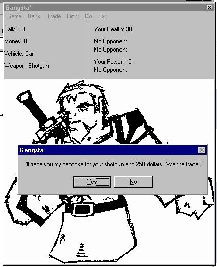



## The Game: Gangstas \(Check It Out\)

### Description

This is a little game i made in about an hour or 2 cause i was really bored. It is a take off of the old game "Drug Wars". The coding i used was really simple, so if you are a newbie who wants to learn to program games, check this out! Try to play it to the end. It gets kinda hard and it is really adicting. (No cheating. No, of course you can't edit your save by changing the number in the file!) You get money from battles and you can use it to buy new forms of transportation to get to new places (and harder battles) or use it to drink, smoke, or buy new weapons. Carefull though, u can get mugged or lose your cash, so be sure to deposit your money in the bank when you get quite a bit.  This game is basically done, but i would like to know how everyone feels about what i could make in such a short ammount of time. :) Please tell me what you think and rate it and leave comments. Thanks. Later.
 
### More Info
 

             |
---                |---
**Submitted On**   |2001-03-04 04:21:26
**By**             |[Harry Maugans](https://github.com/Planet-Source-Code/PSCIndex/blob/master/ByAuthor/harry-maugans.md)
**Level**          |Beginner
**User Rating**    |4.2 (21 globes from 5 users)
**Compatibility**  |VB 6\.0
**Category**       |[Games](https://github.com/Planet-Source-Code/PSCIndex/blob/master/ByCategory/games__1-38.md)
**World**          |[Visual Basic](https://github.com/Planet-Source-Code/PSCIndex/blob/master/ByWorld/visual-basic.md)
**Archive File**   |[The Game\_ 17990462001\.zip](https://github.com/Planet-Source-Code/harry-maugans-the-game-gangstas-check-it-out__1-22179/archive/master.zip)

